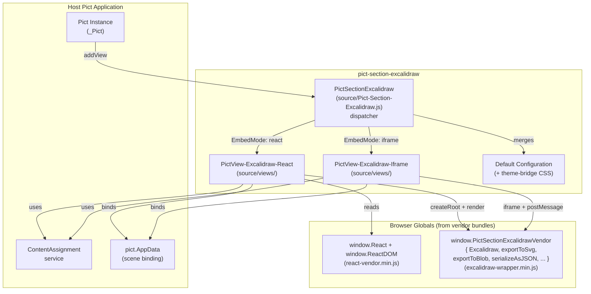
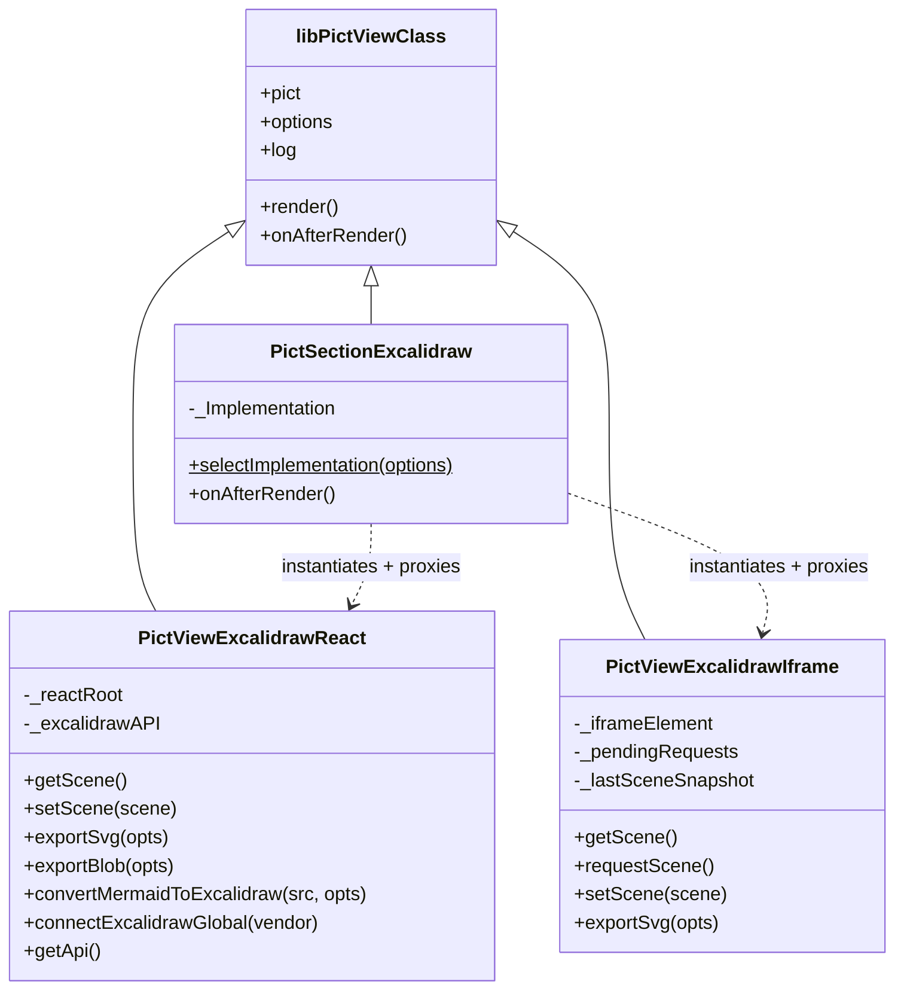
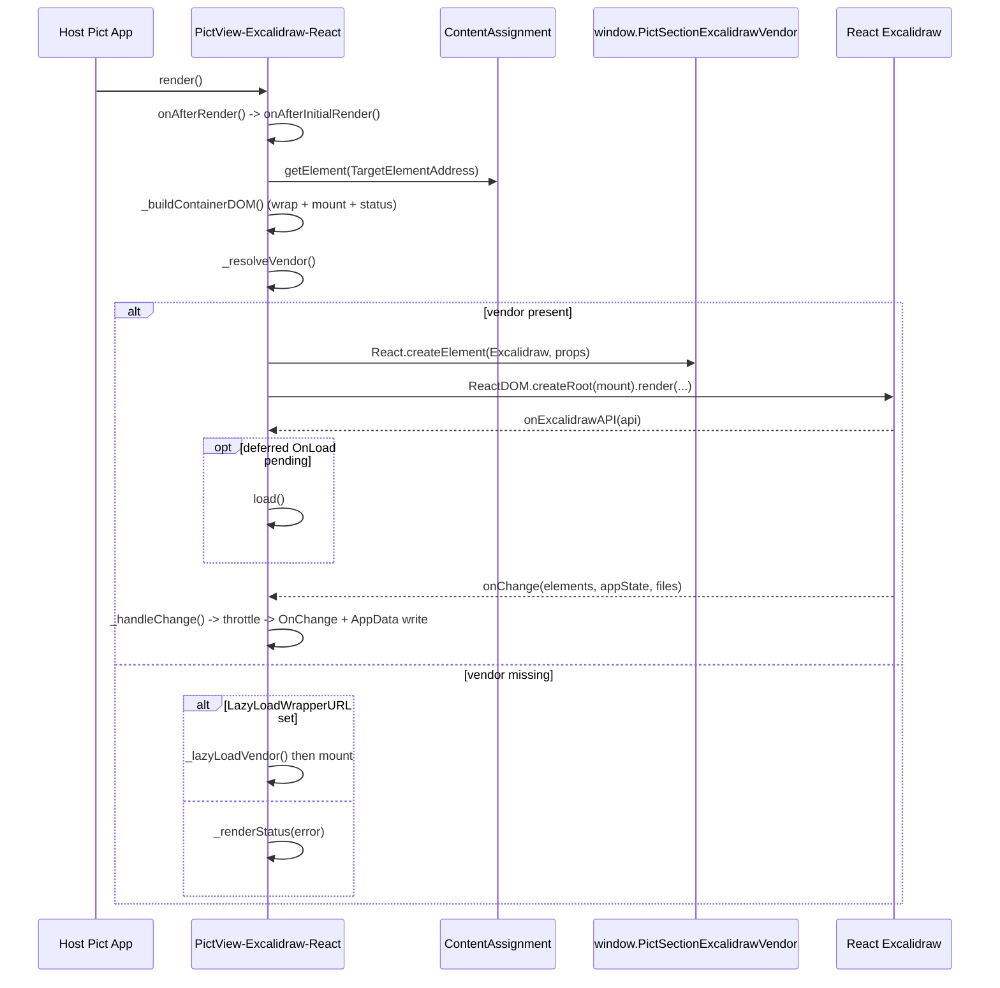
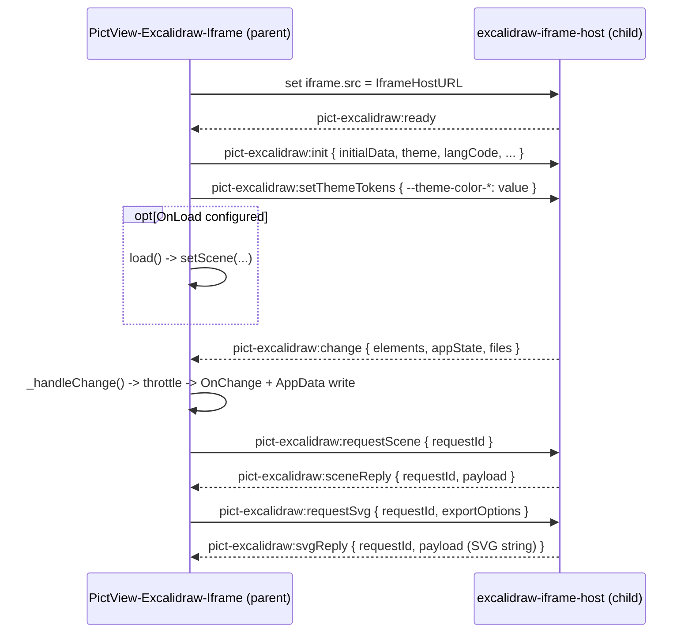

# Architecture

Pict Section Excalidraw is a thin adapter between the [Pict](https://fable-retold.github.io/pict/) MVC framework and [Excalidraw](https://excalidraw.com), the React-based virtual whiteboard. The adapter lives in a dispatch view plus two `pict-view` subclasses -- one per embedding strategy -- and a vendored copy of Excalidraw that the browser bundles are built from.

## Module Map



## The Dispatcher

`PictSectionExcalidraw` (the default export) is a thin dispatch view. It does **not** extend either implementation, because the embed mode is a runtime decision, not a class-level one. Instead it:

1. Merges `default_configuration` with your options.
2. Calls `selectImplementation(options)` -- returns the iframe class when `EmbedMode === 'iframe'`, the React class otherwise.
3. Instantiates the chosen class as a **peer** `pict-view` on the same Fable, with a `-Impl` suffix on its `ViewIdentifier` so AppData / template scopes do not clash.
4. Proxies the public API onto itself, forwarding each method call to the implementation instance.

The forwarded methods are: `getScene`, `setScene`, `exportSvg`, `exportBlob`, `serialize`, `setTheme`, `setReadOnly`, `load`, `save`, `destroy`, `getApi`, `connectExcalidrawGlobal`, `isDestroyed`, and `convertMermaidToExcalidraw`.

When the dispatcher's own render cycle fires (`onAfterRender`), it renders the implementation view exactly once so the implementation can take over the destination div. Most applications subclass `ReactView` or `IframeView` directly (as the bundled examples do) and skip the dispatcher; use the dispatcher when you want a single class whose mode is chosen by configuration.



## The Two Embed Modes

Both modes load the **same** wrapper bundle (`excalidraw-wrapper.min.js`) and present the **same** public API. They differ in where Excalidraw runs and how the view talks to it.

| | `react` (default) | `iframe` |
|---|---|---|
| Mount | `ReactDOM.createRoot` into an inner div | `<iframe>` pointing at `excalidraw-iframe-host.html` |
| Excalidraw API access | Live imperative handle via `getApi()` | Hidden behind postMessage; `getApi()` returns `null` |
| CSS isolation | Shares the page's document | Total -- separate document |
| Theming | CSS bridge variables on the wrap element | Bridge variables piped over postMessage |
| `getScene()` | Reads the live scene synchronously | Returns the last change snapshot; `requestScene()` fetches fresh |
| Best for | Tight theme conformance, smaller footprint when the app already loads React | Hosts with aggressive global styles that bleed into the canvas |

### React-Mount Mode

`PictView-Excalidraw-React` resolves the vendor globals (or accepts them explicitly via `connectExcalidrawGlobal`), builds a wrap/mount/status DOM tree inside the target element, then calls `ReactDOM.createRoot(mountElement)` and renders `<Excalidraw {...props}>`.



Notable details verified in the source:

- The public Excalidraw prop the view passes is `onExcalidrawAPI` (the live API handle callback), plus `onChange`.
- If `OnLoad` is configured but no synchronous scene is available, the view sets a `_pendingDeferredLoad` flag and fires `load()` once the API handle resolves.
- `setTheme()` re-applies the theme via `excalidrawAPI.updateScene({ appState: { theme } })`; Excalidraw has no standalone theme-switch API.
- `EXCALIDRAW_ASSET_PATH` is set from `AssetBaseURL` (if not already set) so Excalidraw can locate fonts and locale chunks.

### Iframe Mode

`PictView-Excalidraw-Iframe` builds an `<iframe>` whose `src` is the configured `IframeHostURL` (default `./excalidraw-iframe-host.html`). The host page loads the same wrapper bundle and mounts Excalidraw inside its own document. The parent view and the iframe communicate over a small `window.postMessage` protocol.



#### postMessage Protocol

Parent to iframe:

| Message `type` | Payload |
|---|---|
| `pict-excalidraw:init` | `{ initialData, theme, langCode, viewModeEnabled, zenModeEnabled, gridModeEnabled, UIOptions, assetBaseURL }` |
| `pict-excalidraw:setScene` | `{ elements, appState, files }` |
| `pict-excalidraw:setTheme` | `'light'` &#124; `'dark'` |
| `pict-excalidraw:setReadOnly` | `boolean` |
| `pict-excalidraw:setThemeTokens` | `{ '--theme-color-...': 'value', ... }` |
| `pict-excalidraw:requestScene` | (carries `requestId`) |
| `pict-excalidraw:requestSvg` | (carries `requestId`, `exportOptions`) |

Iframe to parent:

| Message `type` | Payload |
|---|---|
| `pict-excalidraw:ready` | -- |
| `pict-excalidraw:change` | `{ elements, appState, files }` |
| `pict-excalidraw:sceneReply` | `{ requestId, payload }` |
| `pict-excalidraw:svgReply` | `{ requestId, payload }` (the SVG serialized to a string, since an SVG element is not structured-cloneable) |
| `pict-excalidraw:error` | `{ requestId?, message }` |

Request/reply pairs are matched by an incrementing `requestId`; each pending request carries a 30-second safety timeout that rejects the promise if no reply arrives. The parent only accepts messages whose `event.source` is the iframe's own `contentWindow`.

> `exportBlob()` works in both `react` and `iframe` modes. In iframe mode the view posts a `pict-excalidraw:requestBlob` message and the host returns the PNG blob via `pict-excalidraw:blobReply`, which the parent's message handler resolves.

## Theme Bridge

The wrapper's own chrome is styled with `pict-section-theme` CSS custom properties (`--theme-color-*`), so it re-tints automatically when the host app switches themes. To theme Excalidraw's **own** canvas chrome, the module bridges pict tokens onto the internal CSS variables Excalidraw's stylesheet reads.

The bridge is declared in the default-configuration CSS on the `.pict-excalidraw-wrap` element -- for example:

```css
.pict-excalidraw-wrap
{
	--default-bg-color:   var(--theme-color-background-panel, #FFFFFF);
	--island-bg-color:    var(--theme-color-background-secondary, #FFFFFF);
	--color-primary:      var(--theme-color-brand-primary, #6965DB);
	--button-hover-bg:    var(--theme-color-background-hover, #F1F0FF);
	/* ...and more — see Pict-Section-Excalidraw-DefaultConfiguration.js */
}
```

Each value is a `var(--theme-color-*, fallback)` chain: themes that define the token win, and hosts without a theme provider still get Excalidraw's official light palette via the fallback.

In `iframe` mode the wrap element lives in the parent document, so the bridge variables cannot cascade into the iframe. Instead the parent snapshots a known subset of `--theme-color-*` values off `document.documentElement`'s computed style and ships them to the iframe in a `pict-excalidraw:setThemeTokens` message; the host page applies them as inline custom properties on its own `documentElement`.

The `Theme` option (`'light'` / `'dark'` / `'auto'`) controls Excalidraw's own light/dark mode. `'auto'` follows the pict theme: it checks for a `theme-mode-dark` class on `documentElement` and, failing that, asks `pict.providers.ThemeSection.getCurrentMode()` if the [pict-section-theme](https://fable-retold.github.io/pict-section-theme/) provider is installed.

## Vendoring Strategy

Excalidraw is React-only and lives upstream on GitHub. To insulate the Retold ecosystem from upstream drift -- and from GitHub itself disappearing -- this module mirrors the entire Excalidraw repository into `vendor/excalidraw/`. The mirror has no `.git/`; it is frozen-in-time source that can be patched in place and rebuilt. Drift is a feature: the version that ships is the version that was vetted.

```
vendor/
├── excalidraw/                  Frozen-in-time mirror of github.com/excalidraw/excalidraw
└── excalidraw-built/            Pre-built artifacts shipped to consumers (committed)
    ├── react-vendor.min.js        React + ReactDOM as window globals
    ├── excalidraw-wrapper.min.js  Excalidraw + helpers → window.PictSectionExcalidrawVendor
    ├── excalidraw-wrapper.css     The Excalidraw stylesheet
    ├── excalidraw-iframe-host.html / .js
    └── assets/                    Fonts + locales (EXCALIDRAW_ASSET_PATH)
```

`scripts/Build-Vendor-Bundles.js` (run via `npm run build:vendor`) produces these with esbuild. React and ReactDOM are externalized into a **separate** `react-vendor.min.js` so an app that already loads React can omit it; the wrapper bundle reads `window.React` / `window.ReactDOM` and exposes Excalidraw plus its `exportToSvg` / `exportToBlob` / `serializeAsJSON` / mermaid helpers as `window.PictSectionExcalidrawVendor`.

The committed source for the iframe host page lives under `source/iframe-host/` and is copied into `vendor/excalidraw-built/` by the build.

> The `vendor/excalidraw/` mirror is upstream Excalidraw, not part of this module's API. The wrapper documented here is everything under `source/`.

## File Structure

```
pict-section-excalidraw/
├── README.md
├── package.json
├── source/
│   ├── Pict-Section-Excalidraw.js                    Dispatcher + exports
│   ├── Pict-Section-Excalidraw-DefaultConfiguration.js  Defaults + theme-bridge CSS
│   ├── views/
│   │   ├── PictView-Excalidraw-React.js              React-mount implementation
│   │   └── PictView-Excalidraw-Iframe.js             iframe implementation
│   ├── iframe-host/
│   │   ├── excalidraw-iframe-host.html
│   │   └── excalidraw-iframe-host.js                 Runs inside the iframe
│   └── style-profiles/
│       └── Notebook-Default.js                        Palette/roughness profile for generated diagrams
├── scripts/
│   ├── Build-Vendor-Bundles.js                        Builds vendor/excalidraw-built/
│   └── Generate-Notebook-Diagram.js
├── vendor/                                            (mirrored Excalidraw — not this module's API)
├── example_applications/
│   ├── full_browser_excalidraw/
│   ├── embedded_excalidraw/
│   └── notebook_studio/
└── docs/
    ├── README.md
    ├── _cover.md
    ├── _sidebar.md
    ├── quickstart.md
    ├── architecture.md
    ├── configuration.md
    └── api-reference.md
```

## View State

The implementation views keep runtime state directly on the instance. These are the members you will see referenced from subclass overrides:

| Member | Modes | Description |
|---|---|---|
| `this.targetElement` | both | The destination element the view owns from first render onward. |
| `this._excalidrawAPI` | react | The live Excalidraw imperative API handle (or `null` until mounted). |
| `this._reactRoot` | react | The `ReactDOM.createRoot` handle, unmounted on `destroy()`. |
| `this._vendor` | react | The resolved `{ React, ReactDOM, Excalidraw, ... }` globals. |
| `this._iframeElement` | iframe | The `<iframe>` element hosting Excalidraw. |
| `this._lastSceneSnapshot` | iframe | The most recent scene received over `pict-excalidraw:change`. |
| `this._pendingRequests` | iframe | In-flight request/reply promises keyed by `requestId`. |
| `this._currentTheme` | both | The active theme (`'light'`/`'dark'`/`'auto'`), updated by `setTheme()`. |
| `this._destroyed` | both | Set by `destroy()`; gates public methods so post-teardown calls are no-ops. |
